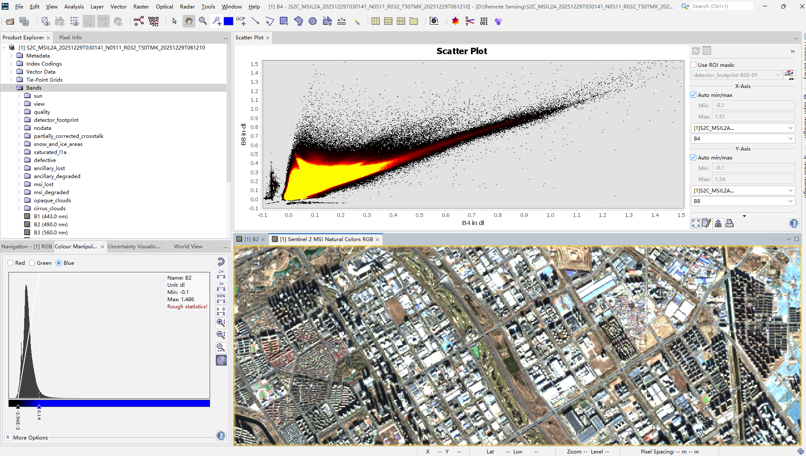
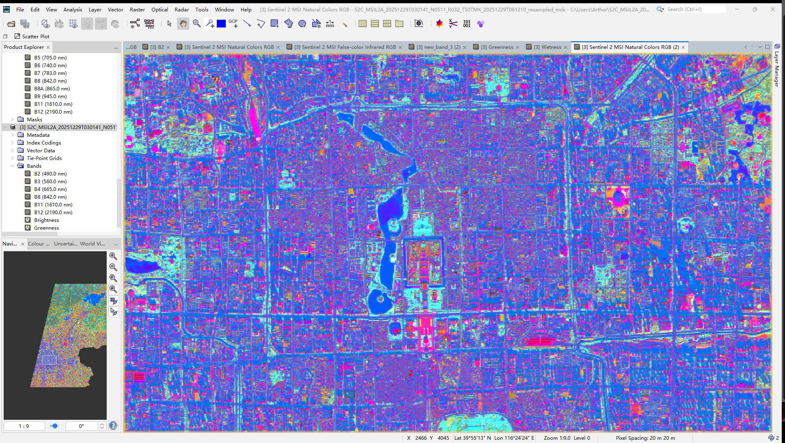
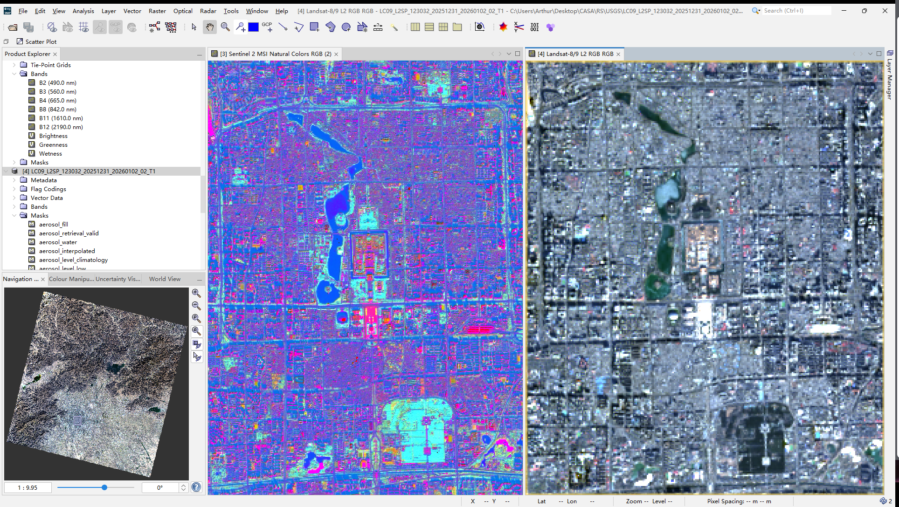
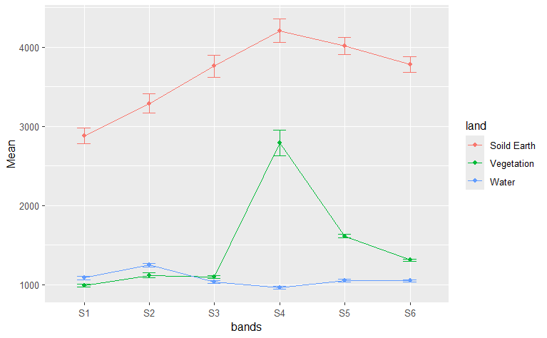
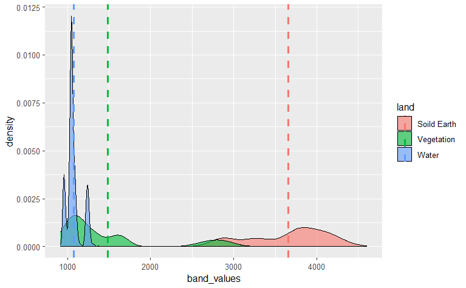

# Week 1 – Introduction to Earth Observation

## Summary

This week introduced the conceptual foundations of Earth Observation (EO) and the overall aims of the module. A central focus was the EO Dashboard, which aggregates satellite-derived indicators from missions such as Sentinel and Landsat to visualise environmental change across space and time. What struck me most was how complex spectral data are translated into accessible, policy-facing narratives. Instead of interacting directly with raw raster datasets, users engage with processed indicators such as NO₂ concentration, land surface temperature, and vegetation indices.

A key technical takeaway was the importance of spatial and temporal resolution trade-offs. Sentinel-2 provides 10 m spatial resolution with frequent revisit times, making it suitable for intra-urban analysis. Landsat, while coarser at 30 m resolution, offers a long historical archive (since the 1980s), which supports longitudinal environmental monitoring (Wulder et al., 2019). These trade-offs highlight that dataset choice fundamentally shapes analytical outcomes.

Prior to computation, all bands were resampled to a common spatial resolution to ensure pixel-level alignment. This step is essential, as bands with different spatial resolutions (10 m vs 20 m) cannot be directly combined without introducing spatial inconsistency. The Brightness image highlighted highly reflective urban surfaces and industrial areas, while water bodies appeared dark. Greenness strongly enhanced vegetated areas, and Wetness clearly separated water and moist surfaces from built-up areas.

------------------------------------------------------------------------

## 

## Applications

EO dashboards demonstrate how satellite data are increasingly embedded in environmental governance. For example, Sentinel-5P satellite data were widely used to assess NO₂ reductions during COVID-19 lockdowns, revealing measurable atmospheric change linked to mobility restrictions (Bauwens et al., 2020; Venter et al., 2020). Similarly, land surface temperature derived from thermal sensors has informed urban heat island research and climate adaptation planning (Voogt & Oke, 2003; Li et al., 2019).

These applications illustrate how EO data can support Sustainable Development Goals (SDGs), particularly those relating to climate action, sustainable cities, and environmental health. However, dashboards necessarily abstract complex processing steps such as atmospheric correction, radiometric calibration, and cloud masking (Jones & Vaughan, 2010). While this abstraction enhances accessibility, it may obscure methodological uncertainty.

The distinction between Sentinel and Landsat also reflects broader research design considerations. High-resolution data enable neighbourhood-scale environmental analysis, while long-term archives support trend detection and policy evaluation. Many contemporary studies integrate both datasets to leverage spatial detail and temporal depth, illustrating the multi-source nature of modern EO research.

------------------------------------------------------------------------

## Reflection

This week positioned EO not simply as satellite imagery, but as an infrastructural system linking science, technology, and governance. The EO Dashboard presents environmental change as measurable and visual, yet the selection of indicators and spatial scales shapes how problems are framed. What is monitored becomes what is prioritised.

From a spatial analysis perspective, I am particularly interested in how EO indicators might be integrated with socio-economic data to examine environmental inequality. For instance, combining NDVI-derived vegetation measures with deprivation indices could reveal patterns of uneven access to green space. However, integrating raster EO data with census geographies introduces methodological challenges such as scale mismatch and the modifiable areal unit problem (MAUP).

Overall, Week 1 has highlighted that EO is not just technical measurement but a form of spatial evidence production. Moving forward, I aim to better understand how spectral data are transformed into policy-relevant indicators, and how that transformation can be critically evaluated.

------------------------------------------------------------------------

## References

Bauwens, M., Compernolle, S., Stavrakou, T., Müller, J.-F., van Gent, J., Eskes, H., et al. (2020). Impact of COVID-19 lockdown on NO₂ pollution assessed using TROPOMI and surface observations.

Jones, H. G., & Vaughan, R. A. (2010). *Remote Sensing of Vegetation: Principles, Techniques, and Applications*. Oxford University Press.

Li, D., Bou-Zeid, E., & Oppenheimer, M. (2019). The effectiveness of cool and green roofs as urban heat island mitigation strategies.

Venter, Z. S., Aunan, K., Chowdhury, S., & Lelieveld, J. (2020). COVID-19 lockdowns cause global air pollution declines.

Voogt, J. A., & Oke, T. R. (2003). Thermal remote sensing of urban climates.

Wulder, M. A., et al. (2019). Current status of Landsat program science and applications.
