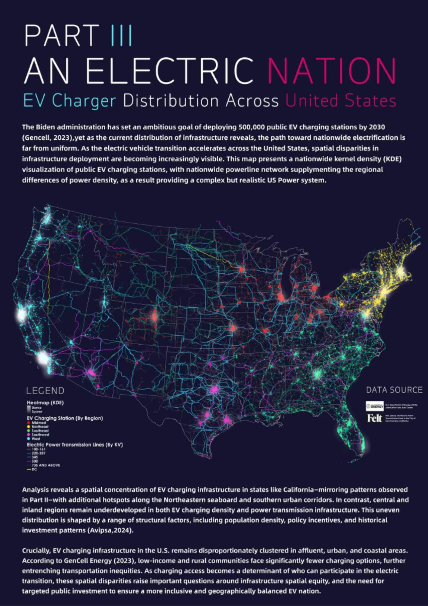
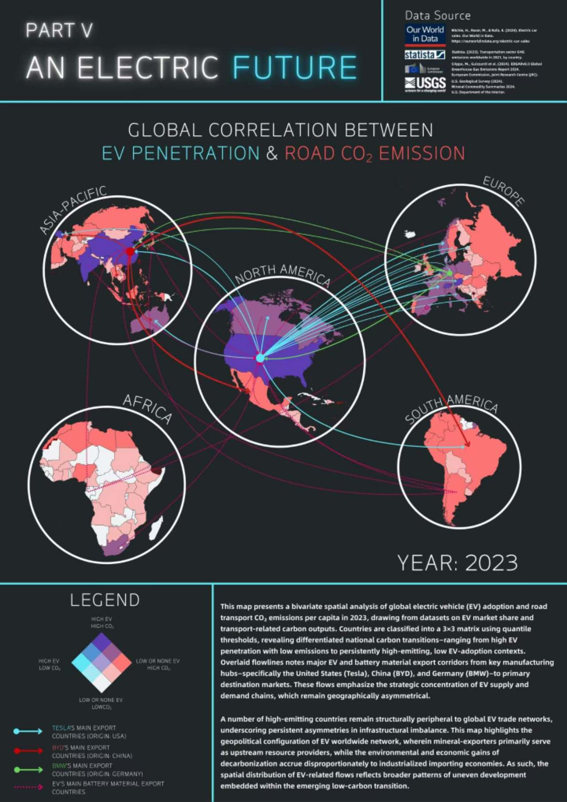
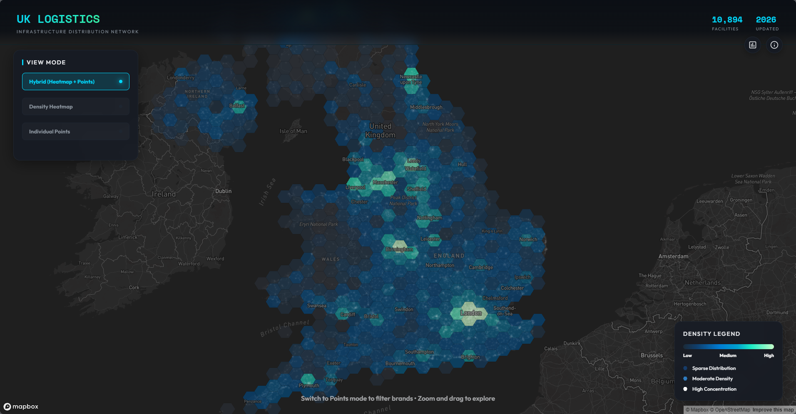
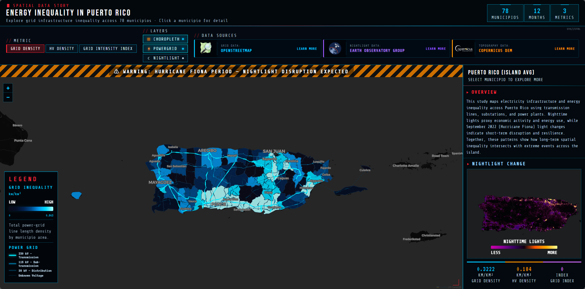

```{=html}
<div class="hero-banner">
  <div class="hero-eyebrow">UCL CASA · 2025–26</div>
  <h1>CASA0023<br>Learning Diary</h1>
  <p class="hero-subtitle">Remotely Sensing Cities and Environments</p>
  <div class="hero-meta">
    <div class="meta-item">
      <span class="meta-label">Author</span>
      <span class="meta-value">Arthur Zhang</span>
    </div>
    <div class="meta-item">
      <span class="meta-label">Module</span>
      <span class="meta-value">CASA0023 — Term 2</span>
    </div>
    <div class="meta-item">
      <span class="meta-label">Format</span>
      <span class="meta-value">Quarto Book</span>
    </div>
  </div>
</div>
```

This diary is a weekly record of what I found interesting, confusing, or worth pushing back on in CASA0023. Each entry follows the same structure — summary, application, reflection — but the goal isn't to produce a textbook summary. It's to track how my thinking about remote sensing and urban analytics actually develops across the term.

```{=html}
<div class="intro-note">
  Each week's entry covers: a <strong>summary</strong> of the core concepts, an <strong>application</strong> examining how EO data links to a real policy or research context, and a <strong>reflection</strong> on what I'm still uncertain about.
</div>
```

## About Me

I'm Arthur, a postgraduate student at UCL CASA reading the MSc in Urban Spatial Science. I came directly from an undergraduate degree in Geography at UCL, where my work gravitated towards spatial visualisation — building maps and interactive tools to make geographic data more legible to different audiences. Moving into CASA felt like a natural continuation: the same curiosity about how cities work spatially, but with a more computational and analytical toolkit.

# Some of my previous work:

::: {layout-ncol="4"}







:::

Remote sensing wasn't a major part of my undergraduate training, which is part of what drew me to this module. The idea that a satellite overpass can tell you something meaningful about a city's thermal stress, its land cover change, or the aftermath of an industrial explosion — and that this data is largely free and openly accessible — still strikes me as genuinely remarkable. My interest in disaster analysis in particular has grown through this course: there's something compelling about the way Earth observation can cut through information blackouts and provide independent, verifiable evidence at moments when ground-truth data is hardest to obtain.

More broadly, what I want from this module is transferable range. I'm less interested in specialising narrowly than in building a set of skills — spatial analysis, EO data processing, statistical modelling, reproducible workflows — that can travel across different problem domains. Whether that ends up being in urban planning, humanitarian response, environmental consultancy, or research, I'd rather arrive with adaptable methods than a single fixed expertise. This diary is, in part, an attempt to track whether that's actually happening.

## Contents

```{=html}
<style>
.week-grid {
  display: grid;
  grid-template-columns: repeat(auto-fill, minmax(280px, 1fr));
  gap: 1.2rem;
  margin: 1.5rem 0 2.5rem 0;
}

.week-card {
  display: block;
  text-decoration: none !important;
  background: #1e1b2e !important;
  border: 1px solid #3d3558 !important;
  border-radius: 12px;
  padding: 1.4rem 1.6rem;
  cursor: pointer;
  transition: transform 0.18s ease, box-shadow 0.18s ease, border-color 0.18s ease;
  position: relative;
  overflow: hidden;
  color: #e2d9f3 !important;
}

.week-card::before {
  content: '';
  position: absolute;
  top: 0; left: 0; right: 0;
  height: 3px;
  background: #c084fc;
  opacity: 0;
  transition: opacity 0.18s ease;
}

.week-card:hover::before {
  opacity: 1;
}

.card-week {
  font-size: 0.72rem;
  font-weight: 700;
  text-transform: uppercase;
  letter-spacing: 0.08em;
  color: #c084fc !important;
  margin-bottom: 0.45rem;
}

.card-title {
  font-size: 0.97rem;
  font-weight: 600;
  color: #e2d9f3 !important;
  line-height: 1.4;
  margin-bottom: 0.75rem;
}

.card-tag {
  display: inline-block;
  font-size: 0.68rem;
  font-weight: 600;
  padding: 0.2rem 0.6rem;
  border-radius: 20px;
  background: #2d1f3d !important;
  color: #c084fc !important;
  letter-spacing: 0.04em;
  text-transform: uppercase;
}

.card-arrow {
  position: absolute;
  bottom: 1.2rem;
  right: 1.4rem;
  font-size: 0.85rem;
  color: #c084fc !important;
  opacity: 0;
  transition: opacity 0.18s ease, transform 0.18s ease;
}

.week-card:hover .card-arrow {
  opacity: 1;
  transform: translateX(3px);
}

.week-card:hover {
  transform: translateY(-3px);
  box-shadow: 0 8px 24px rgba(0,0,0,0.35);
  border-color: #c084fc !important;
  text-decoration: none !important;
}
</style>

<div class="week-grid">

  <a class="week-card" href="week1.html">
    <div class="card-week">Week 1</div>
    <div class="card-title">Introduction to Earth Observation and the EO Dashboard</div>
    <span class="card-tag">Foundations</span>
    <span class="card-arrow">→</span>
  </a>

  <a class="week-card" href="week2.html">
    <div class="card-week">Week 2</div>
    <div class="card-title">Sentinel-2: Spectral Capabilities and Urban Applications</div>
    <span class="card-tag">Sensors</span>
    <span class="card-arrow">→</span>
  </a>

  <a class="week-card" href="week3.html">
    <div class="card-week">Week 3</div>
    <div class="card-title">Remote Sensing Data and Corrections</div>
    <span class="card-tag">Processing</span>
    <span class="card-arrow">→</span>
  </a>

  <a class="week-card" href="week4.html">
    <div class="card-week">Week 4</div>
    <div class="card-title">Policy and EO — Ahmedabad Heat Action Plan</div>
    <span class="card-tag">Policy</span>
    <span class="card-arrow">→</span>
  </a>

  <a class="week-card" href="week5.html">
    <div class="card-week">Week 5</div>
    <div class="card-title">GEE I — Landsat, NDVI, Texture and PCA over Ahmedabad</div>
    <span class="card-tag">GEE</span>
    <span class="card-arrow">→</span>
  </a>

  <a class="week-card" href="week6.html">
    <div class="card-week">Week 6</div>
    <div class="card-title">Classification I — Random Forest Land Cover Mapping</div>
    <span class="card-tag">Classification</span>
    <span class="card-arrow">→</span>
  </a>

  <a class="week-card" href="week7.html">
    <div class="card-week">Week 7</div>
    <div class="card-title">Classification II — Sub-pixel Unmixing and Object-based Analysis</div>
    <span class="card-tag">Classification</span>
    <span class="card-arrow">→</span>
  </a>

  <a class="week-card" href="week8.html">
    <div class="card-week">Week 8</div>
    <div class="card-title">Urban Heat — LST, MODIS Time Series and Ward Heat Index</div>
    <span class="card-tag">Temperature</span>
    <span class="card-arrow">→</span>
  </a>

  <a class="week-card" href="week9.html">
    <div class="card-week">Week 9</div>
    <div class="card-title">SAR Change Detection — Tianjin Port Explosion</div>
    <span class="card-tag">SAR</span>
    <span class="card-arrow">→</span>
  </a>

  <a class="week-card ref-card" href="references.html">
    <div class="card-week">Bibliography</div>
    <div class="card-title">Full Reference List</div>
    <span class="card-tag">References</span>
    <span class="card-arrow">→</span>
  </a>

</div>

<style>
.ref-card {
  background: #12111f !important;
  border-style: dashed !important;
  border-color: #3d3558 !important;
}
.ref-card .card-week {
  color: #94a3b8 !important;
}
.ref-card .card-tag {
  background: #1a1a2e !important;
  color: #94a3b8 !important;
}
.ref-card .card-title {
  color: #94a3b8 !important;
}
.ref-card .card-arrow {
  color: #94a3b8 !important;
}
.ref-card:hover {
  border-color: #94a3b8 !important;
}
.ref-card::before {
  background: #94a3b8 !important;
}
</style>
```

## About this diary

The module runs across Term 2 and covers the full remote sensing pipeline — from sensor physics and data corrections through to classification, temperature analysis, and SAR. The diary entries are written shortly after each lecture and practical session, so they reflect what stood out at the time rather than a polished retrospective.
