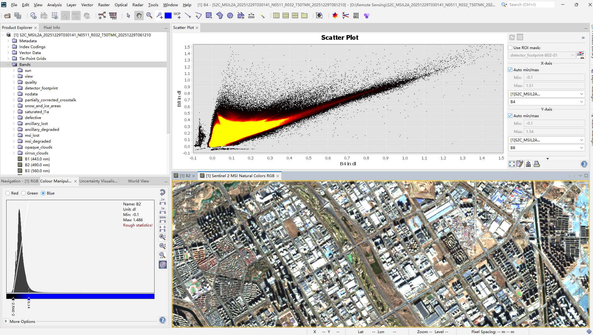
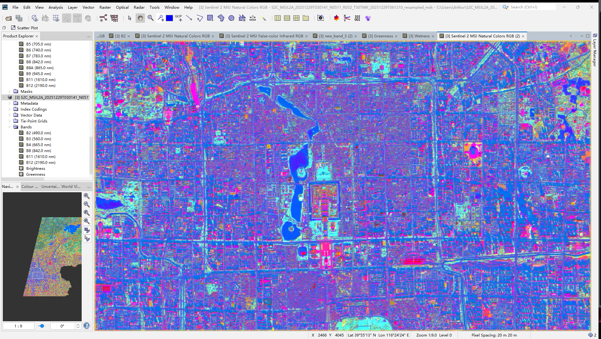
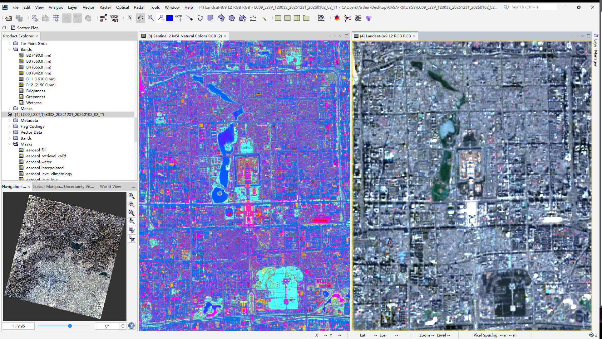

## Summary

The first lecture set up something that turned out to be a useful frame for the rest of the module: Earth observation data rarely reaches you raw. The EO Dashboard is a good illustration — what looks like a simple interface for exploring NO₂ levels or vegetation cover is actually the end of a long pipeline involving atmospheric correction, radiometric calibration, index computation, and spatial aggregation. The practical made this concrete: loading Sentinel-2 imagery of Beijing required decisions about which bands to use, what resolution to resample to, and how to interpret the outputs — none of which are neutral choices.

The resolution trade-off between Sentinel-2 and Landsat is genuinely consequential. At 10 m, Sentinel-2 can resolve individual buildings and street-level features that disappear into background noise at Landsat's 30 m. But Landsat's archive going back to the early 1970s means it can answer questions about long-run change that Sentinel-2 simply cannot yet [@wulder2019]. Neither is universally better — the right choice depends entirely on whether your research question is about spatial detail or temporal depth.

The Tasselled Cap transformation was the most technically interesting part of the practical. Compressing the spectral information from multiple bands into three interpretable components — Brightness, Greenness, Wetness — is not just a dimensionality reduction trick. Each component has a physical meaning tied to surface properties, which is why it persists as a useful tool despite the availability of more sophisticated methods.

------------------------------------------------------------------------

## Application

The clearest recent demonstration of what EO dashboards can do in practice came during COVID-19 lockdowns, when Sentinel-5P NO₂ data provided near-real-time evidence of atmospheric change that ground station networks could not have captured at comparable spatial coverage [@bauwens2020; @venter2020]. The policy value was not in the technical sophistication but in the speed and global consistency — a city-by-city comparison of lockdown effects would have been impossible without satellite data.

The same logic applies to urban heat. Thermal sensors have made it possible to map land surface temperature at the city scale and link it to urban form, vegetation cover, and ultimately health outcomes [@voogt2003]. This is the kind of evidence that feeds directly into climate adaptation planning, and it depends on the processing pipeline being reproducible and transparent — which is where the abstraction in dashboards becomes a double-edged thing. Accessibility is a genuine gain, but it comes at the cost of methodological visibility.

The Sentinel-Landsat distinction matters here too. Studies that need to track change over decades tend to anchor on Landsat because of its archive depth, while studies focused on current conditions or high spatial resolution tend to use Sentinel-2. The most robust work often integrates both [@wulder2019].

------------------------------------------------------------------------

## Reflection

What I kept coming back to during this week was the dashboard framing itself. There is something worth thinking about in the fact that complex satellite data is presented as a clean, navigable interface where environmental problems appear as colour-coded indicators. That design involves choices about what to measure, how to aggregate it, and what threshold counts as significant. Those choices are not technical — they are political. What is monitored becomes what is visible, and what is visible shapes what gets addressed.

I am also uncertain about something more methodological: the EO Dashboard treats spatial resolution as a property of the data, but it is also a property of the question. Measuring urban heat at 30 m resolution misses the block-level variation that actually matters for residents. I did not have a good sense from this week of where the discipline draws the line between "good enough resolution" and "not fit for purpose" — and I suspect that line is often drawn by data availability rather than by what the question actually requires.

The MAUP point from the lecture stayed with me. Aggregating pixel-level data into administrative units is so routine in EO research that it barely gets mentioned, but the choice of unit can change the apparent relationship between variables substantially. That is not a problem unique to remote sensing, but the combination of high-resolution raster data and coarse administrative boundaries makes it particularly acute.
