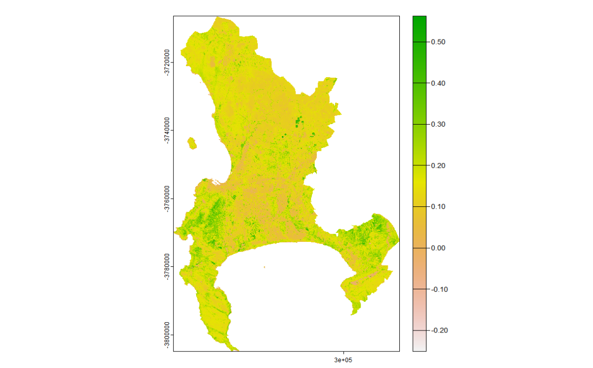
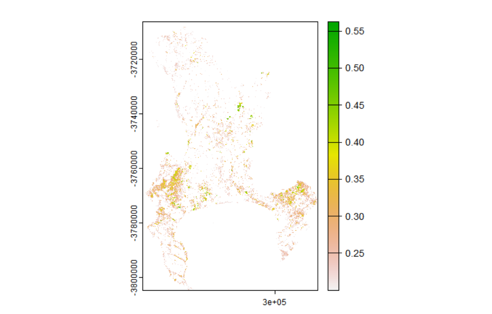
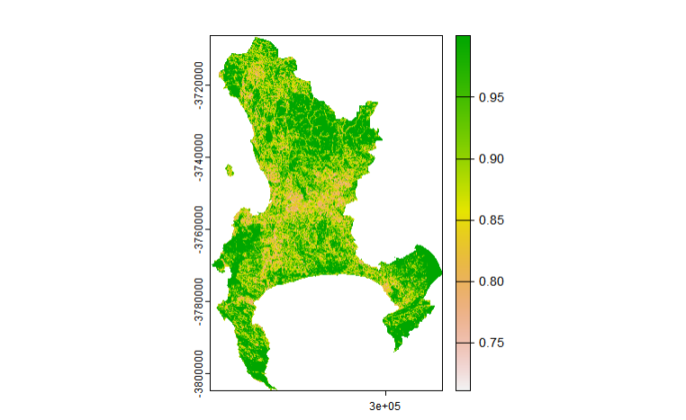
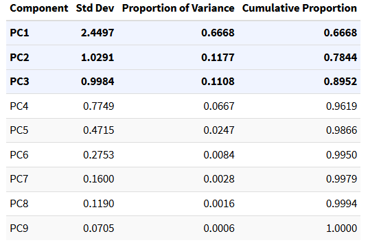

## Summary

The lecture opened with something that reframed how I had been thinking about preprocessing: nearly all Earth observation data now arrives as Analysis Ready Data, meaning most of the corrections covered this week happen automatically before you ever see the image. The reason to understand them anyway is that loading a Landsat image in Google Earth Engine still requires choosing between Level-1 DN, Level-2 surface reflectance, and Level-3 science products — and that choice has real consequences for what the numbers in your raster actually represent. The point that some researchers make this choice without understanding it landed, because I have probably done exactly that.

The corrections run in a fixed order: geometric, then atmospheric, then orthorectification. Geometric correction aligns an image to a coordinate reference system using Ground Control Points at stable features — roads, boundaries — fitting a regression between their distorted and reference positions before warping. The detail that stuck was why backward mapping is preferred: forward mapping can produce predicted positions that fall between grid cells, leaving some output pixels with nothing to assign. Backward mapping starts from the output grid and works in reverse, so every pixel gets a value.

Atmospheric correction deals with path radiance and the adjacency effect. Dark Object Subtraction is the simplest version — find the darkest pixel per band, assume it should be near zero, subtract it from everything else. The logic is defensible but rough, which is why it is treated as a lower bound. Pseudo-Invariant Features are more principled, using regression over stable surfaces to normalise images to a reference date.

The underlying thread is the progression from **Digital Number** to **radiance** to **surface reflectance**. DN is just a storage integer with no physical meaning attached. Radiance adds units via lab-calibrated coefficients — specifically, $L\lambda = Bias + (Gain \times DN)$ — where the bias and gain values are sensor-specific constants provided in the image metadata. Surface reflectance removes both illumination and atmosphere, giving you something that is actually a property of the surface rather than the acquisition conditions — which is what makes cross-date comparison valid. TOA reflectance sits in between: illumination corrected, atmosphere still present. It shows up in papers where the authors judged atmospheric effects negligible. That may be reasonable, but it should be stated rather than buried in a methods footnote.

------------------------------------------------------------------------

## Applications

The practical used Landsat 8 and 9 imagery over Cape Town, which requires at least two tiles to cover the metropolitan area. The tiles were loaded and mosaicked using `terra::mosaic()`:

``` r
library(terra)
library(fs)

listlandsat_8 <- dir_info(here::here("prac_3", "Landsat", "Lsat8")) %>%
  dplyr::filter(str_detect(path, "[B123456790].TIF")) %>%
  dplyr::select(path) %>% pull() %>% as.character() %>%
  terra::rast()

listlandsat_9 <- dir_info(here::here("prac_3", "Landsat", "Lsat9")) %>%
  dplyr::filter(str_detect(path, "[1B23456790].TIF")) %>%
  dplyr::select(path) %>% pull() %>% as.character() %>%
  terra::rast()

m1 <- terra::mosaic(listlandsat_8, listlandsat_9, fun="mean")
```

Taking the mean in the overlap zone is a practical compromise, but it papers over a real issue: even as ARD products, tiles acquired on different dates carry different atmospheric states, and their surface reflectance values may not be perfectly consistent over the same surface features. The mean averages the inconsistency rather than resolving it. The better approach — building a seasonal median composite in GEE — will be covered later in the module, and the contrast in processing time will apparently be stark.

NDVI was then computed and thresholded to isolate vegetated areas:

``` r
m1_NDVI <- (m1_clip$..._SR_B5 - m1_clip$..._SR_B4) /
           (m1_clip$..._SR_B5 + m1_clip$..._SR_B4)

veg <- m1_NDVI %>%
  terra::classify(., cbind(-Inf, 0.2, NA))
```

::: {layout-ncol="2"}



:::

The 0.2 threshold is widely used but context-dependent. For Cape Town's fynbos — a low-growing shrubland that is the city's dominant natural vegetation type — values between 0.1 and 0.2 are common, particularly in drier months. A blanket 0.2 cut-off would exclude a significant portion of ecologically meaningful vegetation, which matters if the downstream application is green space access or heat stress mapping.

The texture analysis used `GLCMTextures` on Band 4 with a 7×7 window, computing GLCM homogeneity. One step that is easy to overlook is rescaling the data before running the texture function — Landsat Level-2 products store reflectance as scaled integers, and the texture metrics would be meaningless if computed on the raw integer values:

``` r
library(GLCMTextures)

scale <- (m1_clip * 0.0000275) + -0.2

textures1 <- glcm_textures(
  scale$..._SR_B4,
  w = c(7, 7),
  n_levels = 4,
  quant_method = "range",
  shift = list(c(1,0), c(1,1), c(0,1), c(-1,1)),
  metrics = "glcm_homogeneity")
```



Homogeneity is high where neighbouring pixels are similar (water, uniform rooftops, formal housing) and low where they vary (construction, informal settlements, mixed vegetation). This is the kind of information that spectral band values alone cannot capture — two areas with identical mean NIR reflectance may look completely different in texture if one is a uniform park canopy and the other is a fragmented mix of trees and rooftops. @lu2012 demonstrated this in Brazilian Amazon land cover classification, where adding texture features substantially improved discrimination between forest types with near-identical spectral signatures. The texture band was then stacked with the spectral data and reduced via PCA, with centering and scaling applied beforehand to prevent variables with larger numerical ranges from dominating the components:

``` r
raster_and_texture <- c(m1_clip, textures1)

pca <- prcomp(as.data.frame(raster_and_texture, na.rm=TRUE),
              center=TRUE, scale=TRUE)
```



------------------------------------------------------------------------

## Reflection

The most useful shift this week was in how I think about what "using satellite data" actually means. Before, I would have treated loading a Landsat image as a neutral act — the data is the data. Now I think there is a real difference between a researcher who can explain what collection, level, and processing model their data went through and one who cannot. That difference probably doesn't matter for a single-date, single-sensor classification, but it matters a lot for anything involving long time series or cross-sensor comparison — which is most of the research questions this module is pointing towards.

On texture: the variance output from GLCM is essentially a spatial derivative — it responds to edges and transitions rather than mean values. For urban analysis, this means building outlines, road margins, and land cover boundaries all become detectable even when the spectral values on either side are similar. I found this genuinely useful to think through, and it suggests that for fine-grained urban classification, texture in SWIR or NIR is probably not optional.

One question I haven't resolved: the practical used a 7×7 window on 30m Landsat, which covers a 210m ground footprint per texture pixel. At that scale, individual buildings and street trees are subsumed within a single kernel. For 10m Sentinel-2 the same window would cover 70m, which is much closer to the scale of the features I would actually want to detect. I am not clear whether there is a principled method for choosing window size relative to resolution and target feature scale, or whether it is largely empirical — and this seems like something that would meaningfully affect results in dense urban environments.

------------------------------------------------------------------------
