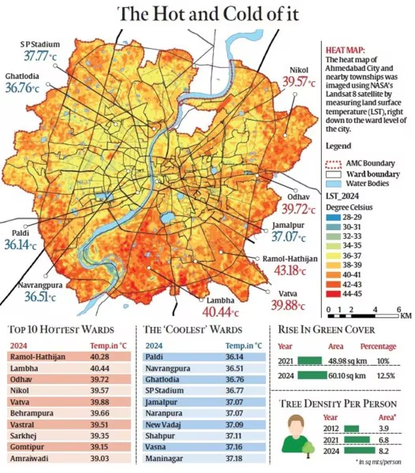
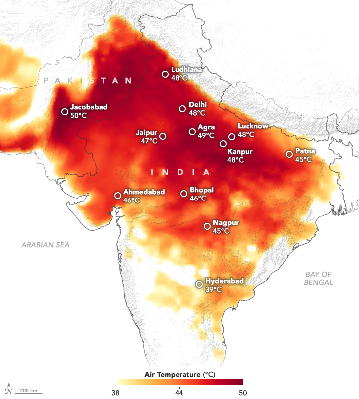
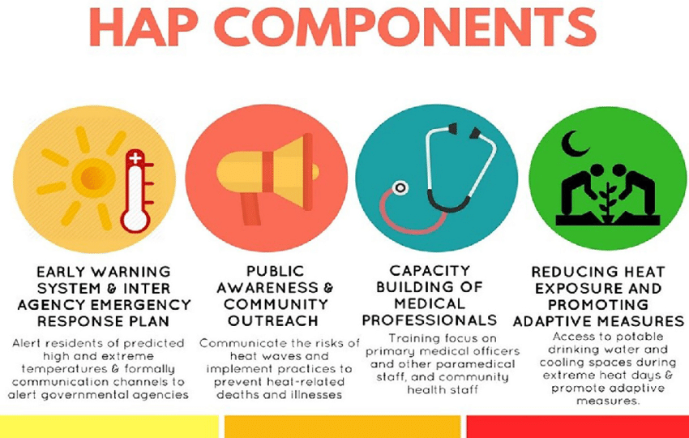
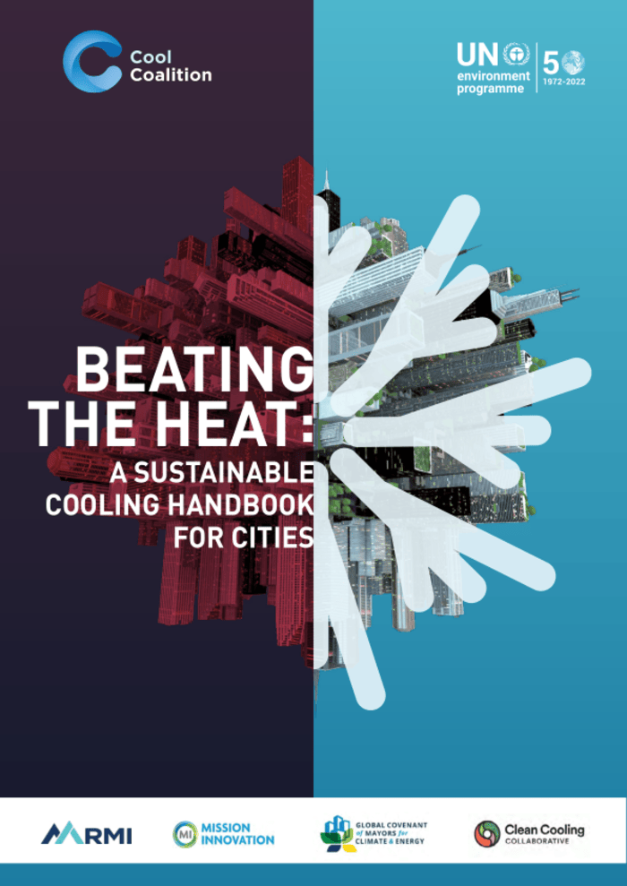
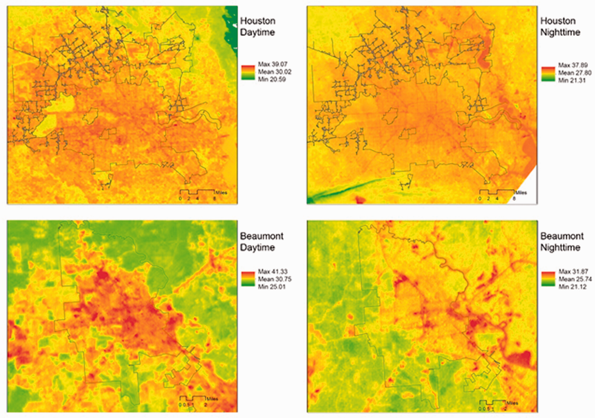

## Summary

::: {layout-ncol="2"}

:::

Ahmedabad, Gujarat's commercial capital with a population of roughly 8 million, experienced one of India's deadliest heat events in May 2010 — an estimated 1,344 excess deaths over a two-week period as temperatures pushed past 46°C [@azhar2014; @nrdc2016]. The city responded with the **Ahmedabad Heat Action Plan (HAP)**, first published in 2013 and significantly revised in 2016, making it South Asia's first formal municipal heat-health framework [@knowlton2014]. The plan operates through four pillars: public awareness and community outreach, training healthcare workers to recognise heat illness, establishing a heat alert system using India Meteorological Department forecasts, and coordinating cooling centres and night shelters. These are genuine public health interventions and the plan has been cited as a global model for its speed and breadth.

The problem, and the reason it is interesting as a case study for this module, is that the 2016 plan contains almost no spatial analysis. It identifies heat as a citywide hazard but does not identify *where within the city* the burden is concentrated, which neighbourhoods have the least access to green space or shade, or which populations are most exposed. The plan's interventions are broadcast-oriented — phone alerts, hospital training, public information — rather than spatially targeted. There is a brief mention of long-term data collection as a future objective, but no Earth observation dataset is named or used.

This is exactly the pattern the lecture described: policy frameworks exist at every level (the New Urban Agenda commits member states to reducing urban heat effects; SDG 11 targets safe, inclusive, green public spaces; the Sendai Framework covers disaster risk reduction), and municipal plans like Ahmedabad's are nominally aligned with all of them. But the chain of alignment runs from global rhetoric to local action without a reproducible, spatially-explicit evidence base linking the two. The COP26 *Beat the Heat* handbook [@unep2021] was the first major international document to explicitly call for Earth observation integration into heat planning — which is a striking admission that until 2021, even the guidance documents were not making this connection.

------------------------------------------------------------------------

## Application

The gap in the Ahmedabad HAP is identifiable and addressable with freely available Earth observation data. Reducing heat-related mortality requires knowing where the thermal burden is highest, which groups are most exposed, and whether interventions are working. Two EO layers are directly relevant.

**Landsat 8/9 LST** at 30 m resolution is the most established approach. Rather than a single summer image — which risks capturing an atypical day — a seasonal composite over Ahmedabad's April–June pre-monsoon window across multiple years would produce a robust heat baseline [@maclachlan2017]. Areas of persistently high LST identify structural hotspots driven by impervious surfaces and vegetation deficit, not weather variability.

**Sentinel-2 NDVI** provides the complementary vegetation layer at 10 m. Green cover and LST are strongly negatively correlated in dense urban environments [@guha2018]. Mapping NDVI deficits against ward boundaries would directly identify where green infrastructure investment would have the most thermal effect — and unlike consultant-produced analyses, the result is reproducible and updatable.

The equity dimension is where this becomes policy-relevant. @li2022, examining 11 Texas cities, found that lower-income neighbourhoods showed consistently higher LST even after controlling for building density, because they had less canopy and more asphalt. Overlaying LST and NDVI with ward-level census indicators would allow the HAP to shift from a citywide alert system to spatially-targeted intervention: cooling centres in high-LST, low-income wards; tree-planting in NDVI-deficient areas; outreach workers directed to the highest-vulnerability blocks first.

However, LST is what satellites measure, not the air temperature a pedestrian experiences [@voogt2003]. Reflective pavements can reduce LST while barely changing felt heat. Any EO analysis feeding into the HAP should be cross-validated against ground-level sensors rather than presented as a direct proxy for human thermal comfort.

------------------------------------------------------------------------

## Reflection

The thing that stuck with me is not about the data. Landsat LST for Ahmedabad has been freely available for decades; the HAP has existed since 2013. Whatever is preventing those two things from connecting is not a technical problem, and a better satellite product would not fix it. The Cape Town example from the lecture — departments legally unable to share data with each other under normal timescales — suggested the bottleneck sits somewhere in institutional structure, not in what sensors can resolve.

The **inequality–equity–justice** framing is useful up to a point. Shifting from equality to equity — directing resources toward the hottest, most socially vulnerable wards — seems tractable if the political will exists and the spatial evidence is in front of the right people at the right moment. The justice step is a different order of problem. An LST map can illustrate why certain areas carry a disproportionate heat burden, but the underlying causes — land use history, decades of differential investment in canopy and infrastructure — are not addressable through remote sensing.

The causality question in the LST-deprivation relationship is one I did not find a satisfying answer to. @li2022 documents the association across eleven Texas cities, but the cross-sectional design cannot separate two plausible mechanisms: disinvestment producing hotter neighbourhoods through less canopy and more asphalt, versus high-LST areas becoming cheaper over time as residents with options leave. The policy implication differs — one points toward targeted greening, the other toward housing and land-use reform — and it is not clear that EO evidence alone can adjudicate between them.

------------------------------------------------------------------------
