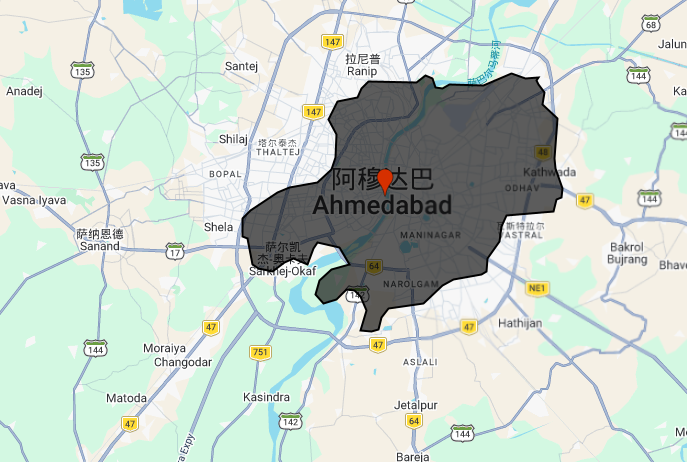
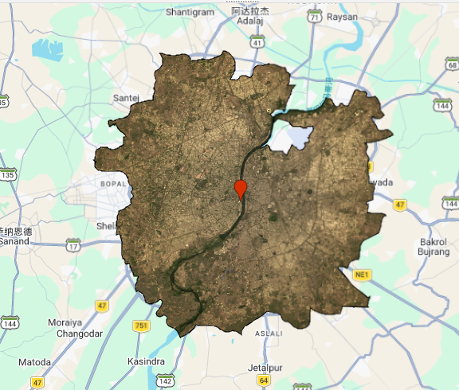
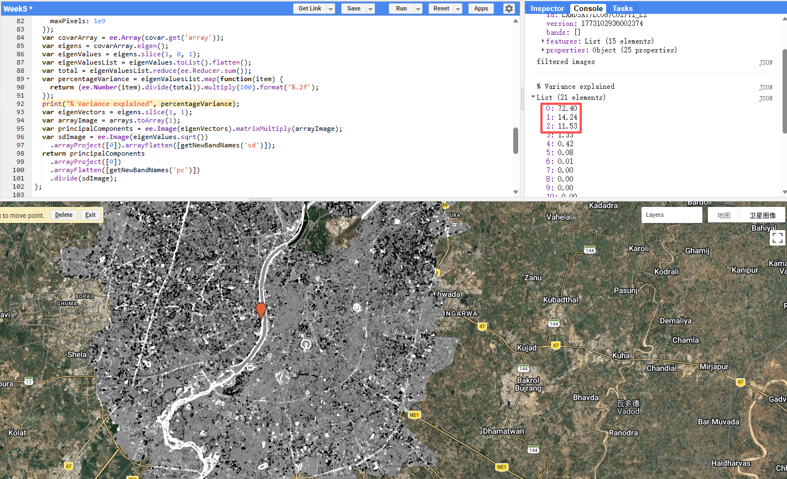
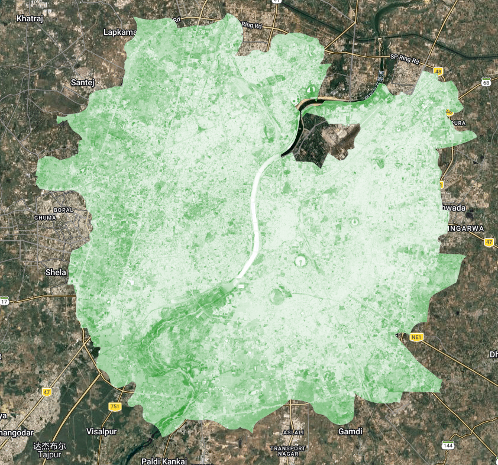

# Week 5: Google Earth Engine I

## Summary

This week marked a significant shift from working locally in R to using **Google Earth Engine (GEE)** — a cloud-based platform that processes geospatial data on remote servers rather than your own machine. The core idea is that instead of downloading satellite imagery and running analysis locally, you write JavaScript code that gets sent to Google's servers, executed there, and the results streamed back. This makes planetary-scale analysis feasible in seconds.

The key conceptual shift is understanding **client vs. server-side** processing. Any object prefixed with `ee` (e.g. `ee.ImageCollection`) is a "proxy object" — it exists on the server and has no data in your local environment. This is why you can't use regular `for` loops in GEE; the loop can't iterate over something it hasn't evaluated. Instead, you use `.map()` to apply a function across all images simultaneously on distributed machines — the same idea as `purrr::map()` in R but running at scale.

GEE's data model maps neatly onto familiar concepts: **Image** = raster, **Feature** = vector with attributes, and **ImageCollection/FeatureCollection** = stacks of either. Scale (pixel resolution) is set by the output, not input — GEE picks the right image pyramid level automatically, which removes a lot of projection headaches common in R or QGIS.

In the practical I worked with Ahmedabad, India for our presentation topic. After filtering Landsat 8 imagery (2021–2022, cloud cover \< 0.1%) down to 15 scenes, I applied surface reflectance scaling factors via a mapped function, computed a mean composite, and clipped to the AMC (Ahmedabad Municipal Corporation) ward boundary — uploaded as a shapefile Asset after converting from KML. I initially used a GADM Level 3 district boundary which cannot match all area with the examples I researched online for our presentation study：

switching to the official AMC wards and merging them with `.union()` produced a much more meaningful urban extent .

{width="686"}

From there I computed GLCM texture (contrast and dissimilarity across all 7 bands) and ran PCA on the resulting 21-band stack. PC1 explained 72.4% of variance, PC2 a further 14.2%, meaning just two components captured 86.6% of all information — a substantial dimensionality reduction from 21 bands.

The mean composite clipped to the AMC boundary revealed the Sabarmati River running north–south through the city, with denser urban fabric to the east and more mixed land cover to the west.

------------------------------------------------------------------------

## Applications

GEE has become the dominant platform for large-scale urban remote sensing studies, largely because of its ability to process multi-decade image archives without local infrastructure. Mutanga & Kumar (2019) highlight this in their review, noting that GEE has democratised access to satellite analysis for researchers in data-poor regions who previously couldn't afford the storage or compute costs. For urban applications specifically, this matters — cities in the Global South often face the greatest environmental pressures but have the fewest analytical resources.

One area where GEE-based workflows have been particularly impactful is urban heat island (UHI) research, directly relevant to Ahmedabad. Guha et al. (2018) used Landsat-derived land surface temperature and NDVI in Ahmedabad to show a strong negative correlation between vegetation cover and surface temperature — exactly the kind of analysis that can be operationalised at scale in GEE. The NDVI output from this week's practical produced results consistent with their findings: the river corridor and peripheral green spaces showed notably higher NDVI values than the dense urban core. More recently, reporting from *The Indian Express* noted that Ahmedabad's surface temperatures have dropped 2–3°C since 2020, attributed to increased green cover — a change that would be straightforward to quantify using GEE's temporal capabilities and the NDVI methods practised this week.

The use of GLCM texture alongside spectral bands — as done in this practical — reflects a broader trend in urban classification literature. Zhang et al. (2017) demonstrated that adding GLCM features to Landsat data significantly improved urban land use classification accuracy compared to spectral bands alone, particularly for distinguishing industrial from residential areas. The PCA step makes this practically feasible: without dimensionality reduction, feeding 21 correlated bands into a classifier would introduce noise and computational overhead. PCA removes the redundancy, retaining the meaningful variance in just a few components. The PC2 layer proved particularly informative, capturing the contrast between the river/vegetation and the built-up environment.

------------------------------------------------------------------------

## Reflection

What struck me most this week was how much the **choice of study area boundary** affects the analysis — something easy to overlook. The GADM district boundary made Ahmedabad look predominantly rural and agricultural, while the AMC ward boundary revealed the dense, compact urban form that actually characterises the city. This is not just a cosmetic issue; if I were computing mean NDVI or surface temperature for "Ahmedabad," the two boundaries would give substantially different results and potentially opposite conclusions about urban greenness. It's a reminder that spatial units are analytical decisions, not neutral containers, and that decisions made early in a workflow (like boundary choice) propagate through everything downstream. Going forward, I want to be more deliberate about documenting and justifying these choices rather than defaulting to whatever administrative boundary is most convenient to download.

