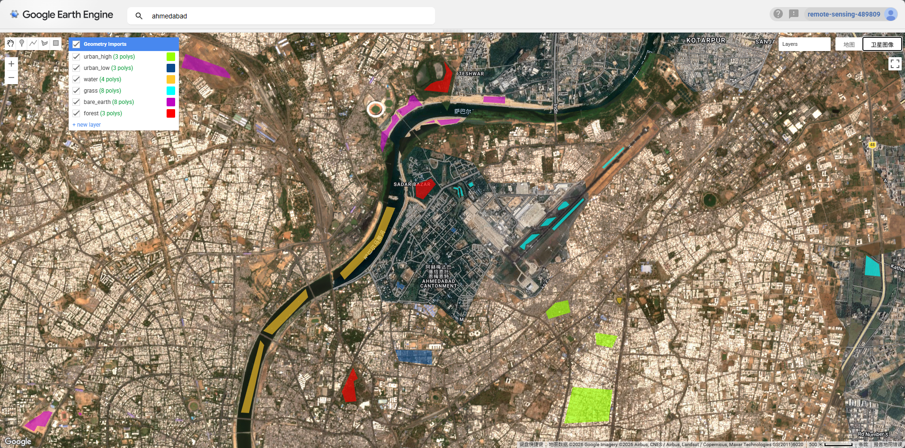
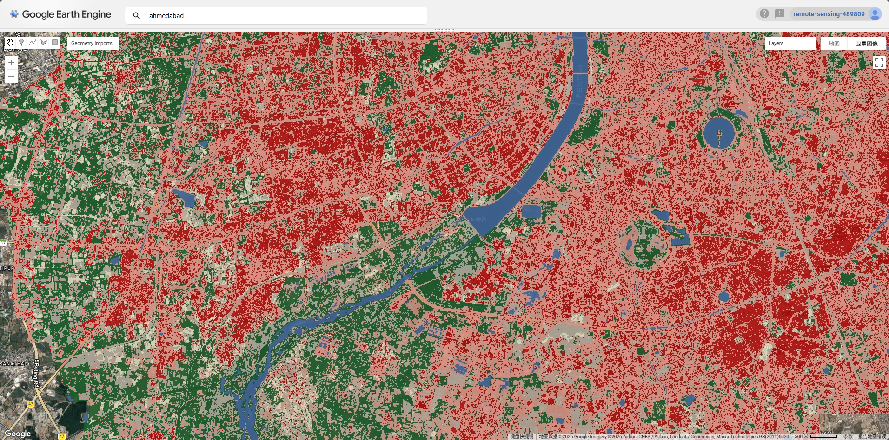
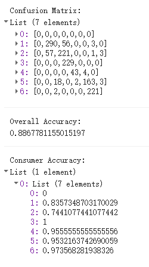

## Summary

This week introduced supervised image classification — the process of assigning every pixel in a satellite image to a predefined land cover category. The lecture framed classification as a form of **inductive machine learning**: given labelled training examples, the model learns spectral patterns and applies them to unseen pixels. Two core algorithms were covered in detail.

**Classification and Regression Trees (CART)** work by recursively partitioning the feature space using a series of binary decisions. For classification tasks, splits are chosen to minimise **Gini impurity** — a measure of how mixed the classes are in each resulting node. The key challenge with CART is overfitting: a tree grown without limits will perfectly memorise training data but generalise poorly. This is controlled through pruning, which removes leaves based on a tree score that penalises complexity (SSR + alpha × number of leaves), with the optimal alpha selected via cross-validation.

**Random Forests (RF)** address the instability of individual trees by growing many trees on bootstrap samples of the data, with each split considering only a random subset of variables. The final classification is determined by majority vote across all trees. The out-of-bag (OOB) error — computed on the \~30% of data not used in each tree's bootstrap sample — provides an internal accuracy estimate without needing a separate test set. In this week's practical I used a 100-tree RF on Sentinel-2 imagery of Ahmedabad, achieving an overall accuracy of **88.7%** on held-out validation data.

For the practical, I loaded Sentinel-2 SR Harmonized imagery (2022, \<20% cloud cover per tile) with a QA60 bitmask cloud mask applied at the pixel level. After clipping to the AMC boundary, I manually digitised training polygons for six land cover classes: high-density urban, low-density urban, water, grass, bare earth, and forest.

A pixel-level 70/30 train-test split was applied — randomly sampling 1,000 points per class and assigning a random column — to avoid the problem of splitting too few polygons. The resulting classified map shows the city is dominated by urban feature, with the Sabarmati River clearly delineated and patches of vegetation concentrated at the periphery.

The confusion matrix reveals that water achieved 100% consumer accuracy, forest 97.4%, and grass 95.6% — all spectrally distinct classes. The main source of confusion was between high- and low-density urban (classes 1 and 2), which is expected given their similar spectral signatures in the visible and NIR bands.

------------------------------------------------------------------------

## Applications

Land cover classification from satellite imagery underpins a wide range of urban research and policy applications. One of the most direct uses relevant to Ahmedabad is urban expansion monitoring. @maclachlan2017 used Landsat-derived classifications to quantify urban growth in Perth's metropolitan region between 1990 and 2015, demonstrating how multi-temporal classification can track sprawl patterns at the city scale. A comparable analysis for Ahmedabad — one of India's fastest-growing cities — would be highly policy-relevant given its rapid peri-urban expansion since the 2000s.

The lecture also highlighted how land cover classifications are used as inputs to secondary analyses rather than as end products in themselves. @fuldalu2021 combined classified land use data with Sentinel-derived air pollutant concentrations (PM₂.₅, NO₂, SO₂) to examine how urban form shapes air quality in Tehran, using the LULC layer as an independent variable in regression. This kind of downstream application — where classification feeds into environmental or health modelling — is arguably more valuable than the classified map alone. In the Ahmedabad context, combining a land cover classification with LST data (as covered in Week 8) would allow direct testing of the relationship between impervious surface extent and the urban heat island intensity documented by @guha2018. The RF classifier used this week produces exactly the kind of detailed urban/non-urban distinction needed for that analysis.

------------------------------------------------------------------------

## Reflection

The most practically important thing I learnt this week was how sensitive classification accuracy is to the quality and spatial distribution of training data. My first attempt — with only 2 polygons each for grass and bare earth — produced 0% consumer accuracy for both classes, despite an apparently reasonable overall accuracy of 89.5%. The model had simply learnt to ignore those classes entirely. Adding more spatially distributed polygons brought both classes above 88%. This is a well-known problem in supervised classification: overall accuracy is an optimistic metric when class sizes are imbalanced, and it can mask complete failure on minority classes. In real-world applications — say, monitoring urban green space for a city like Ahmedabad — missing the "grass" class entirely would make the output useless for policy, regardless of what the headline accuracy figure says. It reinforced for me that accuracy assessment needs to be reported at the per-class level, not just as a single number.
