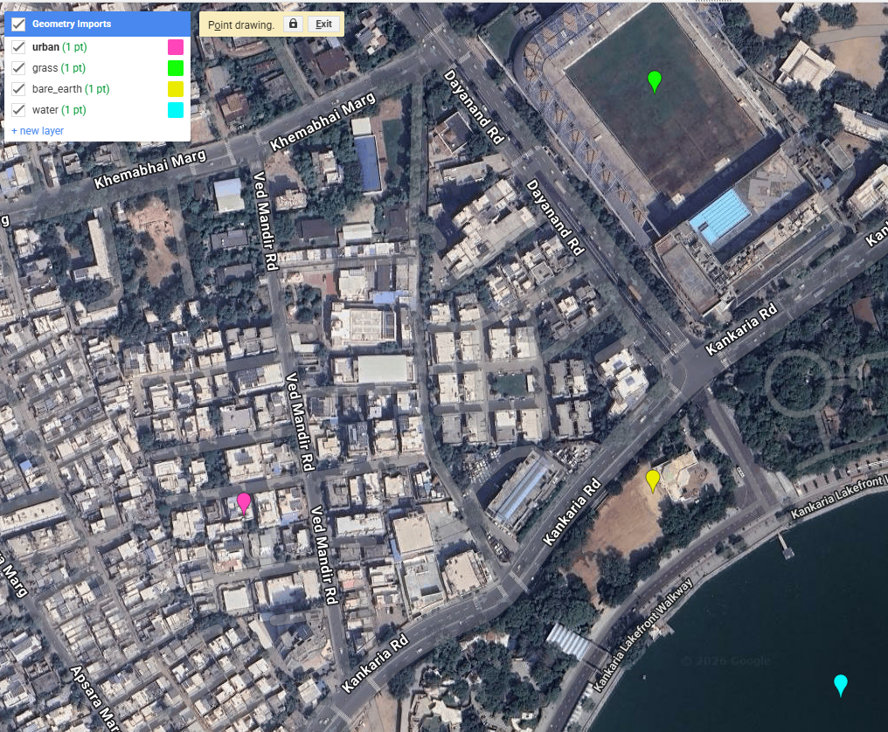
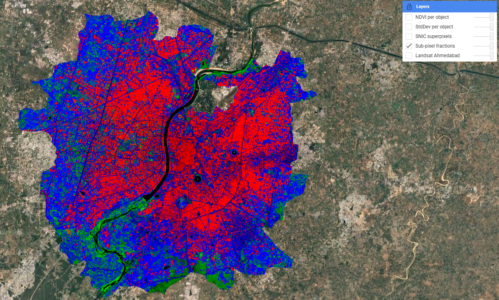
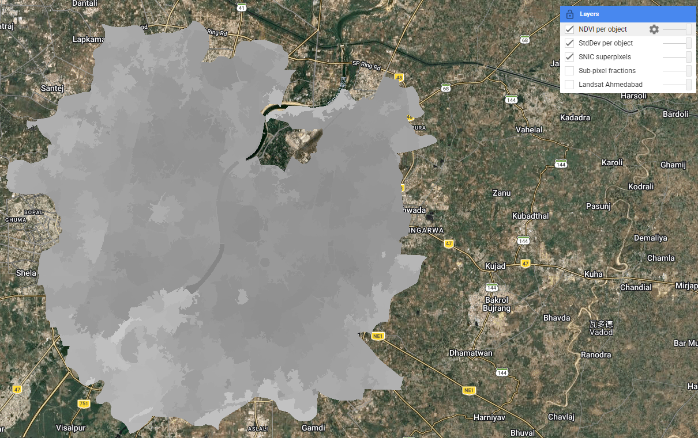
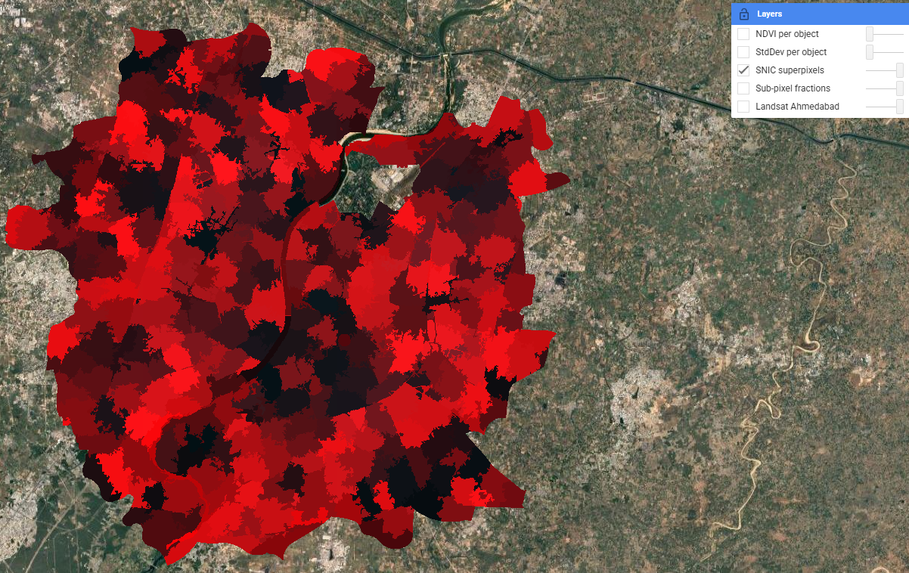
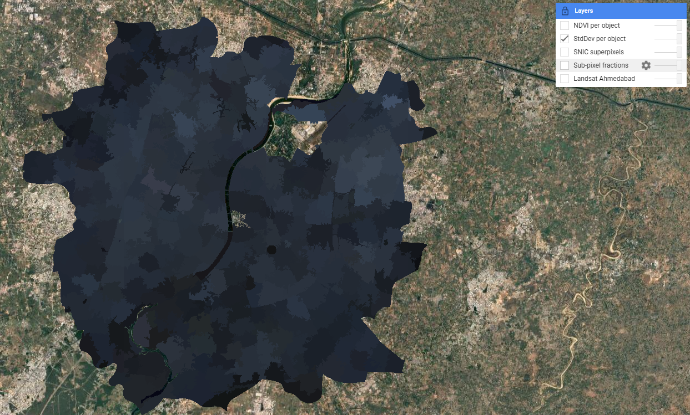

## Summary

This week extended the classification methods from Week 6 into two more sophisticated approaches: **sub-pixel spectral unmixing** and **Object-Based Image Analysis (OBIA)** using SNIC superpixels. Both address a fundamental limitation of standard pixel-based classification — that every pixel in medium-resolution imagery (30m Landsat) is likely to contain a mixture of land cover types rather than a single pure class.

**Spectral unmixing** works by defining spectrally pure *endmembers* for each land cover class and computing the fractional contribution of each endmember to every pixel. In GEE this is implemented via `.unmix()`, with constrained outputs ensuring fractions are non-negative and sum to 1. In the practical I extracted mean spectral values from four point samples (urban, grass, bare earth, water) over the Landsat 8 image of Ahmedabad, and used these as endmembers.

The result reveals a smooth, continuous surface where each pixel holds a mixture of land cover proportions — in contrast to the hard boundaries produced by Random Forest last week. The Sabarmati River is particularly striking as a clean black corridor, reflecting near-zero contributions from all non-water endmembers.

**SNIC (Simple Non-Iterative Clustering)** superpixels take a different approach: rather than classifying pixels individually, pixels are first grouped into spatially coherent *objects* based on spectral and spatial proximity. A hexagonal seed grid is placed at regular intervals and pixels are assigned to the nearest seed based on a combination of colour distance and spatial distance, controlled by the `compactness` parameter. The resulting objects follow land cover boundaries far more naturally than a regular grid would. Per-object NDVI and standard deviation were then computed as additional features that could feed into a subsequent classifier — adding shape and texture context that pure spectral classification misses.

::: {layout-ncol="3"}

:::

The lecture also covered accuracy assessment in depth. The standard **confusion matrix** yields three key metrics: **producer's accuracy** (TP/TP+FN — how well the classification meets the creator's expectation), **user's accuracy** (TP/TP+FP — how reliable the map is for the end user), and **overall accuracy**. Beyond these, the lecture introduced the **F1 score** — the harmonic mean of precision and recall — which avoids the trap of optimising for one at the expense of the other. The **ROC curve** and **AUC** (Area Under Curve) go further still, showing classifier performance across all possible decision thresholds. A perfect classifier has AUC = 1; random guessing gives 0.5. These metrics matter because overall accuracy alone can be misleading when class sizes are imbalanced — a classifier that always predicts "urban" in a 90% urban scene will look 90% accurate while being completely useless.

A critical warning from @karasiak2022 is that **spatial autocorrelation between training and test pixels** — when both are drawn from the same polygon — can massively inflate apparent accuracy. Nearby pixels share similar spectral values (Tobler's first law), so a model trained on part of a polygon will trivially perform well on the rest of it. The solution is **spatial cross-validation**: partitioning training and test sets using geographic distance (e.g. a buffer based on Moran's I) to ensure spatial independence. The pixel-level train-test split used in Week 6 partially addresses this but does not fully resolve the problem when training polygons are spatially clustered.

------------------------------------------------------------------------

## Applications

Sub-pixel and object-based methods have found particularly strong uptake in urban informal settlement mapping, where the heterogeneous mix of materials and the fine-grained spatial structure of slums makes pixel-based approaches unreliable. @matarira2023 combined Sentinel-1 SAR, Sentinel-2 optical and PlanetScope high-resolution data in an OBIA framework in GEE to map informal settlements in Durban, South Africa, achieving substantially better delineation of settlement boundaries than pixel-based methods. The ability of OBIA to incorporate shape, texture, and context — not just spectral values — is critical in this application: informal roofing materials often have similar spectral signatures to formal urban structures, but their spatial arrangement and object geometry differ markedly.

The accuracy assessment issues raised in the lecture have direct implications for how classification results are used in policy. @karasiak2022 showed that spatial dependence between training and test data is a major source of overoptimistic accuracy — a problem particularly relevant for studies like urban heat island mapping in Ahmedabad, where training polygons are likely to be clustered in easily accessible or visually distinctive areas. If the reported accuracy of a green cover classification is inflated by spatial autocorrelation, and that classification is fed into the city's Heat Action Plan to identify high-risk wards, the consequences of misclassification fall disproportionately on the most vulnerable communities. This connects accuracy assessment from a technical exercise to an ethical one. An alternative to custom classification is to use pre-classified products like **Dynamic World** (near real-time 10m Sentinel-2 based classification by Google), which uses a Fully Convolutional Neural Network trained on expert-labelled tiles — though as the lecture noted, its "blobby" appearance at boundaries reflects the 50×50m minimum mapping unit used in training.

------------------------------------------------------------------------

## Reflection

What I found most thought-provoking this week was the accuracy assessment discussion — specifically the point that spatial autocorrelation between training and test data can make a model look far more accurate than it actually is. Looking back at last week's 88.7% overall accuracy, I have to acknowledge that because my training polygons were relatively small and clustered in recognisable areas of the city, the validation pixels drawn from those same polygons were almost certainly spatially correlated with the training pixels. A spatially cross-validated accuracy would likely be lower. This doesn't invalidate the exercise, but it does mean I should treat the 88.7% figure as an upper bound rather than a reliable estimate. It's a good reminder that accuracy metrics in remote sensing are not objective measurements — they reflect choices about how validation data is collected and structured, and those choices can be just as consequential as the classification algorithm itself.
