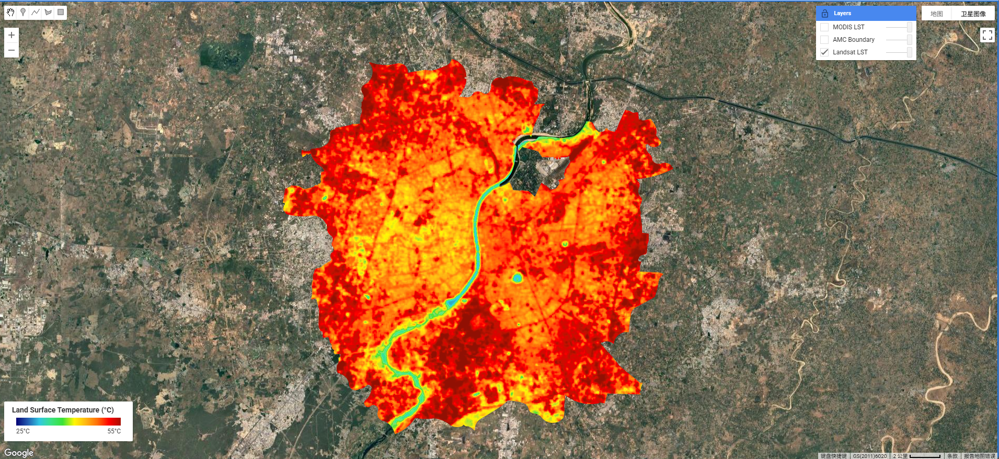
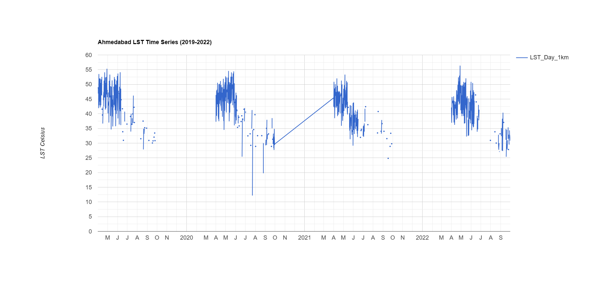
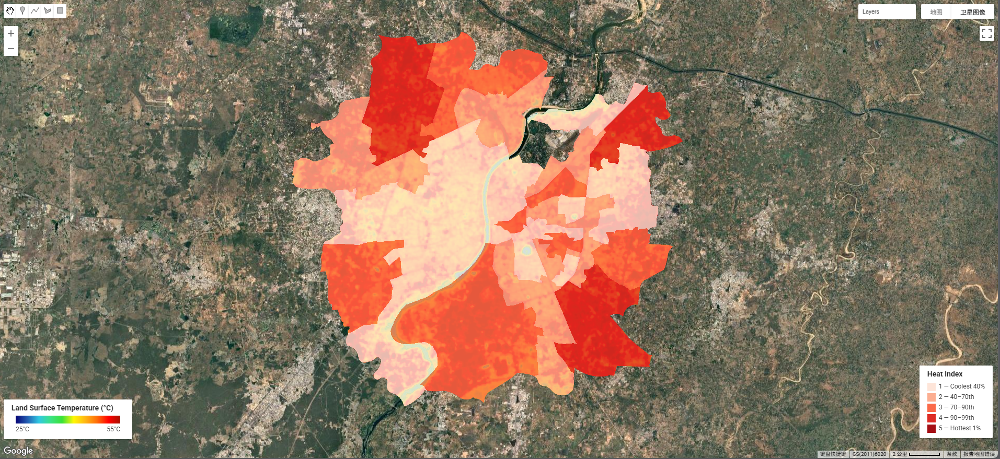
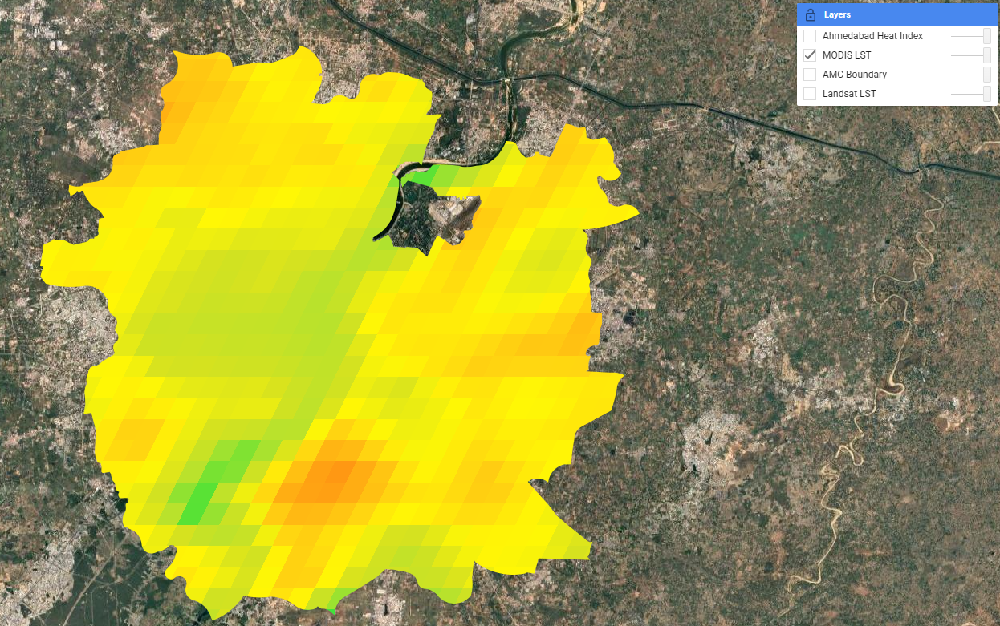

## Summary

This week's content on Land Surface Temperature (LST) and the Urban Heat Island (UHI) effect was directly and immediately relevant to our group presentation project — **EO-HEAT Ahmedabad** — which proposes a £500,000 bid to the Ahmedabad Municipal Corporation (AMC) to deliver a spatially-explicit, ward-level heat vulnerability assessment. Much of what was introduced in the practical this week forms the technical backbone of our presentation's project.

The practical demonstrated two complementary approaches to measuring LST. **Landsat 8 Band 10** (thermal infrared, 30m) provides the fine spatial resolution needed to distinguish temperature variation between individual wards, while **MODIS** (Terra + Aqua, 1km, near-daily) enables the long-term trend analysis that forms the evidential basis for our project pitch. Critically, both data sources are free and available through GEE — directly addressing one of the key "value for money" arguments in our presentation: that the entire analytical pipeline can be built on open data at zero marginal data cost.

I applied the full LST workflow to Ahmedabad using Landsat 8 scenes filtered to the Indian hot season (April–September, 2019–2022) with cloud cover below 1%. After applying the thermal scaling factor (×0.00341802 + 149.0) and converting from Kelvin to Celsius, the mean composite (@fig-lst) revealed a striking urban heat island signature entirely consistent with the problem framing in our Slide 2. The dense built-up core reaches 45–50°C, while the Sabarmati River corridor is 10–15°C cooler — exactly the kind of intra-urban spatial variation that our presentation argues is invisible to the meteorological station network that the current HAP relies on.

{#fig-lst}

The MODIS time series across 2019–2022 showed consistent pre-monsoon LST peaks of 50–55°C — data that maps directly onto our presentation's Slide 2 claim of a "46.8°C peak temperature" during the 2010 heat wave and supports the argument that such extremes are a recurring, not exceptional, feature of Ahmedabad's climate.

{#fig-timeseries}

Finally, I computed a ward-level **heat index** using percentile-based risk classification (Index 1–5, mirroring the BBC heat hazard methodology), producing a choropleth map directly analogous to the **Heat Vulnerability Index (HVI)** output proposed in our project. The highest-risk wards (Index 4–5) are concentrated in the northern and eastern periphery — new development areas with lower tree cover — which aligns with the inequality framing of our presentation plan.

{#fig-heatindex}

------------------------------------------------------------------------

## Applications

Ahmedabad is the paradigmatic case study for heat policy in South Asia. The 2010 heat wave caused an estimated 1,344 excess deaths @azhar2014, directly triggering the development of South Asia's first Heat Action Plan (HAP) in 2013, updated in 2019 @nrdc2016. The HAP operates through four pillars — early warning, public awareness, medical preparedness, and reducing heat exposure — but as @knowlton2014 document in their evaluation of the HAP's development, its spatial targeting relies on city-wide meteorological thresholds rather than ward-level risk data. This is the precise gap our EO-HEAT project proposes to fill: the Landsat and MODIS LST workflow demonstrated this week provides the spatial resolution and temporal depth that would allow the HAP to move from city-wide activation triggers to targeted, ward-level interventions.

This framing is supported by a growing literature on the relationship between urban form, LST, and health outcomes. @voogt2003 established the theoretical basis for using thermal remote sensing to characterise urban climates, showing that LST correlates strongly with air temperature patterns at the neighbourhood scale — the scale at which health risks are actually experienced. @li2022 extended this by demonstrating in 11 US cities that historically disinvested neighbourhoods experience disproportionately high LST, mediated by lower tree canopy and higher impervious surface fractions. While the political economy of Ahmedabad differs from US cities, the spatial inequality mechanism is analogous: informal settlements and lower-income peripheral wards have lower NDVI and higher LST, as visible in this week's heat index map. This connection between EO-derived LST and social vulnerability is precisely what our project integration framework models, combining LST with NDVI and census demographics to produce a composite HVI. The @unep2021 sustainable cooling handbook for cities further reinforces the policy relevance, noting that LST-based risk mapping is now considered best practice for urban heat action planning globally — giving our methodology direct policy legitimacy in the presentation.

------------------------------------------------------------------------

## Reflection

This week felt genuinely productive in a way that went beyond the technical. Actually running the LST workflow on Ahmedabad — rather than just reading about it — gave me a much more concrete sense of what our presentation's outputs will look like, and more importantly, what their limitations are. The MODIS layer was clearly too coarse for ward-level analysis (1km pixels spanning multiple wards), which reinforces our presentation's methodological choice to use Landsat as the primary LST product and MODIS only for long-term trend analysis.

{#fig-MODIS} 

The heat index map also raised a question I hadn't considered before: the ward boundaries used in this exercise are the AMC administrative wards, but population density within each ward varies enormously — a ward with Index 5 LST but very low population is quite different from one with Index 5 and high population density. That interaction between physical heat hazard and demographic exposure is exactly what our project is supposed to capture, and seeing the limitations of a pure LST-based approach in practice has made me more confident that our multi-layer HVI methodology is the right design choice.
