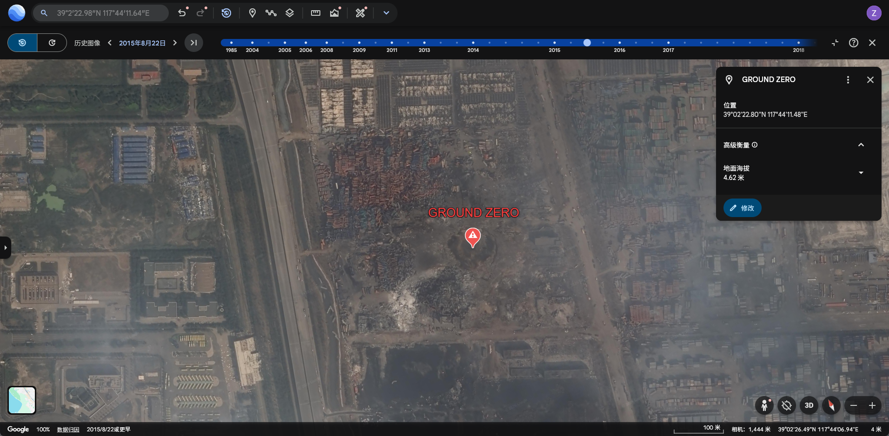
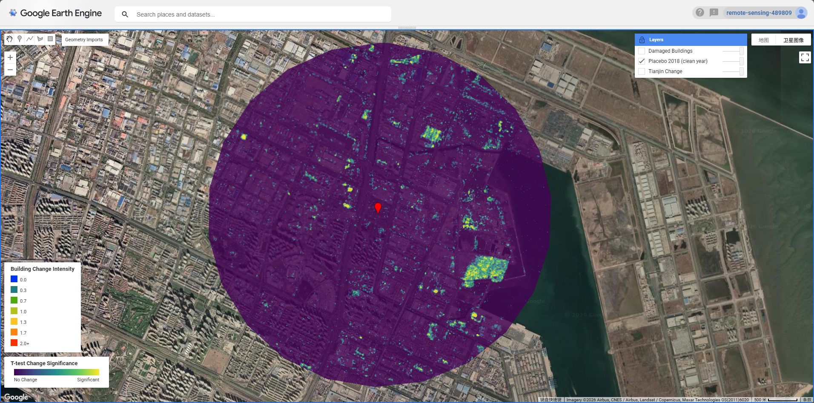

# Week 9: SAR Change Detection — Tianjin Port Explosion

## Summary

Synthetic Aperture Radar (SAR) is an active microwave sensor that transmits its own energy and records the backscatter return from the Earth's surface. Unlike passive optical sensors, SAR operates independently of solar illumination and can penetrate cloud cover, making it especially valuable for disaster response and urban monitoring. The Sentinel-1 constellation, operated by ESA, provides freely available C-band SAR data at 10 m spatial resolution in Interferometric Wide (IW) swath mode, with a revisit time of 6–12 days.

SAR backscatter intensity is determined by surface roughness, dielectric properties, and geometry. Urban areas with orthogonal building structures produce strong **double-bounce** returns due to the corner reflector effect between walls and the ground. Explosions and structural collapse fundamentally alter these geometric properties, suppressing double-bounce returns and increasing diffuse scattering — a phenomenon that can be detected statistically through pre- and post-event time series comparison.

This week's practical applied the **Ballinger open-source SAR change detection framework** to the 2015 Tianjin Port explosion. On 12 August 2015, a series of explosions at the Ruihai International Logistics warehouse in Tianjin's Binhai New Area resulted in 173 fatalities, injured over 800 people, and caused widespread structural damage across a 2 km radius. The event provides an ideal test case for SAR-based damage detection given its sudden, large-scale nature and its occurrence at a well-defined location (Ground Zero: 39.0397°N, 117.7365°E).



The statistical framework used was a **Welch's t-test** applied pixel-by-pixel to compare mean backscatter values before and after the event, accounting for variance across the entire image time series. Higher t-statistics indicate greater change significance. Speckle reduction was applied using a 3×3 focal mean filter (`reduceNeighborhood`) prior to analysis, following best practice for urban SAR interpretation.

{#fig-change}

## Application

### Change Detection Results

Sentinel-1 DESCENDING orbit imagery was used, filtered to the dominant relative orbit number (mode) to ensure geometric consistency. The pre-event period spanned six months prior to 12 August 2015, and the post-event window covered three months following the explosion — reflecting the practical limitation that Sentinel-1 had only been operational since April 2014, yielding just **two available pre-event images** over the site. This sparse pre-event stack is a recognised limitation of the approach: with fewer observations, the t-test has reduced statistical power and the variance estimate is less stable.

The composite change map, produced by averaging ASCENDING and DESCENDING orbit results, confirmed a broad zone of significant SAR backscatter change centred on the warehouse district and extending into the surrounding residential area — consistent with the known blast radius and pressure wave damage reported in the official post-disaster survey.

### Building-Level Damage Assessment

OSM building footprints were extracted via Overpass Turbo for the wider Tianjin Binhai area and uploaded to GEE as a user asset (`projects/remote-sensing-489809/assets/Tianjin`). The `reduceRegions()` function was used to compute mean t-test scores within each building polygon, identifying structures with statistically significant change (mean \> 0).

Within the 3 km AOI, **372 OSM buildings** showed statistically significant post-explosion backscatter change. This figure should be interpreted as a lower-bound estimate: OSM coverage of industrial zones in China is incomplete, with large warehouse complexes, chemical storage facilities, and cargo handling infrastructure typically absent from the volunteer-contributed dataset. The actual number of affected structures is substantially higher, consistent with official reports citing damage to over 17,000 residential units and hundreds of warehouses.

{#fig-buildings}

### Placebo Test Validation

A key methodological concern in port environments is that SAR backscatter naturally varies due to vessel movements, crane operations, and cargo handling — all of which could be misidentified as explosion-related change. To address this, a **placebo test** was conducted using 2018 as a control year: the identical algorithm was applied with a 12 August 2018 cutoff, using the same pre/post intervals. The 2018 result shows substantially less widespread high-significance change compared to 2015, providing evidence that the 2015 signal is attributable to the explosion rather than background port dynamics.

{#fig-placebo}

Note that 2016 was deliberately avoided as a placebo year due to ongoing demolition and reconstruction activity, which would have produced its own elevated SAR change signal and confounded the test.

## Reflection

This practical highlighted both the strengths and limitations of SAR-based damage assessment in complex urban-industrial environments. The t-test approach [@schulte2018] is computationally efficient and interpretable, but its performance depends critically on the size of the pre-event image stack. The Tianjin case was challenging precisely because Sentinel-1 was relatively new in 2015, leaving only two pre-event acquisitions — a situation unlikely to recur for events occurring after 2017 when the archive had matured.

The failure of conventional building footprint datasets (Microsoft Building Footprints, Google Open Buildings, and OSM) to adequately cover Chinese industrial zones raises a broader point about **data justice in disaster remote sensing**: the areas most difficult to map with volunteered geographic data — informal settlements, industrial zones, and areas in countries with mapping data restrictions — are often the same areas where rapid damage assessment is most needed. Pixel-level area statistics offer a pragmatic alternative when vector building data is unavailable.

Perhaps the most methodologically interesting finding was the mismatch between visual inspection and statistical significance. The t-test is mean-based: in heterogeneous urban environments, some pixels increase in backscatter (new debris piles, exposed foundations) while others decrease (collapsed roofs reducing double-bounce), and these can cancel out in the mean. Standard deviation-based change metrics or coherence-based InSAR approaches may be more robust for detecting structural change in dense urban fabrics.

Looking ahead to the group project and other analytical contexts, the combination of SAR change detection with building footprints — even an incomplete dataset — offers a scalable, near-real-time workflow for rapid damage assessment that requires no cloud-free optical imagery and functions at night. The Copernicus Emergency Management Service (CEMS) now operationalises similar approaches for humanitarian response [@plank2014], though the 10 m spatial resolution of Sentinel-1 remains a limiting factor for individual building-scale assessment compared to very high resolution optical sensors.

A natural extension of this 2D analysis would be to incorporate 3D building geometry. Ballinger [-@ballinger2020] demonstrated this compellingly for the 2020 Beirut explosion, using OSM building height data and the `BlenderOSM` add-on to construct a full 3D urban model of the affected area. By combining this with Blender's **dynamic wave simulation** — treating the pressure wave as a fluid interacting with building geometries — it becomes possible to model how blast energy is reflected, channelled, and attenuated by the urban fabric in ways that 2D bird's-eye damage maps fundamentally cannot capture. A building in the shadow of a large warehouse, for instance, may show minimal SAR change despite being structurally compromised on its blast-facing façade. The Tianjin port environment, with its mix of large warehouse blocks and lower residential buildings, would be a particularly instructive case for this kind of directional blast modelling. Future work combining SAR-derived change detection with OSM 3D building extrusions and Blender fluid simulation could provide a more physically meaningful account of damage propagation — and would represent an interesting bridge between remote sensing, computational physics, and open urban data.

## Code

The full GEE implementation is available in the `Week9 Special Episode` script under `users/thedawn0609/GEE`.

Key functions:

``` javascript
// Speckle filtering
function s1_filter(image) {
  return image.focal_mean(3, 'square', 'pixels');
}

// Pixel-wise t-test (adapted from Bellingcat RS4OSINT framework)
function ttest(collection, shock_date, pre_months, post_months) {
  var shock = ee.Date(shock_date);
  var pre = collection.filterDate(
    shock.advance(-pre_months, 'month'), shock);
  var post = collection.filterDate(
    shock, shock.advance(post_months, 'month'));
  var pre_mean = pre.mean();
  var post_mean = post.mean();
  var pre_var = pre.reduce(ee.Reducer.variance());
  var post_var = post.reduce(ee.Reducer.variance());
  var n_pre = pre.size();
  var n_post = post.size();
  var se = (pre_var.divide(n_pre)
    .add(post_var.divide(n_post)))
    .sqrt();
  var t = post_mean.subtract(pre_mean).abs().divide(se);
  return t;
}

// Building damage assessment using OSM footprints
var buildings = ee
  .FeatureCollection("projects/remote-sensing-489809/assets/Tianjin")
  .filterBounds(aoi);

var damaged_buildings = threshold.reduceRegions({
  collection: buildings,
  reducer: ee.Reducer.mean(),
  scale: 10,
});

print("Affected buildings:", 
  damaged_buildings.filter(ee.Filter.gt("mean", 0)).size());
// Result: 372
```
